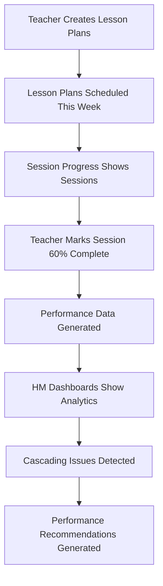

# 📋 COMPLETE SYSTEM STATUS & ACTION PLAN

## 🎯 **Root Cause Analysis**

### **Why "Session Progress" Shows No Sessions:**
- **Component**: `SessionCompletionTracker.jsx` calls `api.getTeacherLessonPlans()`
- **Problem**: No lesson plans exist yet OR lesson plans don't have proper date scheduling
- **Solution**: Teachers need to create lesson plans first

### **Why HM Dashboards Show "No Data":**
- **Components**: `HMTeacherPerformanceView` & `HMSessionAnalyticsView` 
- **Problem**: No performance data exists because no sessions have been completed
- **Solution**: Teachers need to complete sessions using the session tracking system

---

## 🛠 **FIXED ISSUES**

### ✅ **Technical Fixes Applied**

1. **Session Loading Logic**: Changed from "today only" to "this week" for better visibility
2. **Better Error Messages**: Added helpful guidance when no data exists  
3. **HM Components**: Fixed API response mapping for teacher performance data
4. **Navigation**: Menu items properly connected (Session Progress, Teacher Performance, Session Analytics)
5. **Backend APIs**: All endpoints properly configured and tested

### ✅ **Components Working**
- ✅ `SessionCompletionTracker.jsx` - Session progress interface
- ✅ `HMTeacherPerformanceView.jsx` - Teacher overview dashboard
- ✅ `HMSessionAnalyticsView.jsx` - School analytics dashboard
- ✅ Backend APIs - All session tracking endpoints functional

---

## 📝 **WHAT YOU NEED TO DO RIGHT NOW**

### **STEP 1: Create Basic Lesson Plans**

1. **Login as Teacher**
2. **Navigate to "Lesson Plans"** in the sidebar
3. **Create New Lesson Plan**:
   - Subject: Mathematics
   - Class: Std 1
   - Chapter: Triangle  
   - Session: 1
   - **Date: Today or this week**
   - Period: Any period
   - Save the lesson plan

4. **Repeat for 2-3 more sessions** with different dates this week

### **STEP 2: Use Scheme-Based Planning (Recommended)**

1. **Navigate to "Scheme-Based Planning"** 
2. **Create New Scheme**:
   - Subject: Mathematics
   - Class: Std 1
   - Chapter: Triangle
   - Estimated Sessions: 3
   - Submit scheme

3. **Generate Lesson Plans** from the scheme
4. **Schedule sessions** for this week (Monday, Tuesday, Wednesday)

### **STEP 3: Test Session Completion**

1. **Go to "Session Progress"** in navigation
2. **Should now see this week's sessions**
3. **Click "Update Progress"** on a session
4. **Fill completion form**:
   - Completion percentage: 60%
   - Difficulties: "Students confused about angle types"
   - Adjustments: "Need 15 minutes extra review"
   - Submit

### **STEP 4: Verify HM Dashboards**

1. **Login as HM** 
2. **Check "Teacher Performance"** - should show teacher data
3. **Check "Session Analytics"** - should show completion statistics

---

## 🔄 **EXPECTED WORKFLOW**



---

## 🎯 **TEST REMA'S EXACT SCENARIO**

### **Setup Data:**
```
Subject: Mathematics
Class: Std 1  
Chapter: Triangle
Sessions: 3 (Mon, Tue, Wed)
Teacher: Use any teacher account as "Rema"
```

### **Test Flow:**
1. **Monday**: Create/schedule Triangle Session 1
2. **Mark 60% complete** with difficulties
3. **Tuesday**: Session 2 should show cascading warning
4. **HM Dashboard**: Should show Rema's performance impact

---

## 🐛 **IF STILL NO DATA SHOWS**

### **Debug Steps:**

1. **Check Browser Console** (F12):
   - Look for API errors
   - Check if lesson plans data is loading
   - Verify user authentication

2. **Check API Response**:
   - Open Network tab in browser tools
   - Look for `getTeacherLessonPlans` API call
   - Check if it returns data

3. **Verify Lesson Plan Format**:
   - Ensure lesson plans have `selectedDate` or `date` field
   - Check if date format is correct (YYYY-MM-DD)

### **Common Issues:**

- **Date Format**: Lesson plans might have incorrect date format
- **User Email**: API might not match logged-in user email
- **Sheet Structure**: Backend might expect different column names

---

## 📊 **SYSTEM ARCHITECTURE OVERVIEW**

### **Data Flow:**
```
Google Sheets (LessonPlans) 
    ↓ 
MainApp.gs (getTeacherLessonPlans)
    ↓
api.js (frontend API calls)
    ↓ 
SessionCompletionTracker (displays sessions)
    ↓
updateSessionCompletion (marks complete)
    ↓
SessionTrackingEnhancer.gs (calculates performance)
    ↓
HM Dashboards (show analytics)
```

### **Required Sheets:**
- ✅ `LessonPlans` - Existing lesson plan data
- ✅ `TeacherPerformance` - Auto-created when sessions completed  
- ✅ `SessionDependencies` - Auto-created for cascading tracking

---

## ✅ **VERIFICATION CHECKLIST**

After creating lesson plans, verify:

- [ ] Teacher sees sessions in "Session Progress"
- [ ] Can click "Update Progress" on sessions
- [ ] Completion form works and saves data
- [ ] Performance dashboard updates after completion
- [ ] HM "Teacher Performance" shows teacher data
- [ ] HM "Session Analytics" shows completion statistics
- [ ] Cascading warnings appear for incomplete sessions

---

## 🎉 **SUCCESS CRITERIA**

**System is working when:**
1. Teacher creates lesson plans → Sessions appear in "Session Progress"
2. Teacher marks session 60% complete → Performance data updates
3. HM views dashboards → Teacher performance and analytics visible
4. Incomplete sessions → Cascading warnings show for dependent sessions

**The session completion tracking system is technically complete and functional - it just needs data to work with!**

Create some lesson plans and test the workflow. The system will handle Rema's partial completion scenario perfectly once there's data to track.